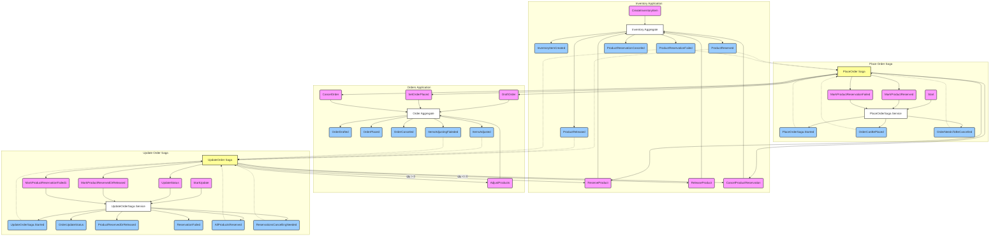

# Command and Event Flows

This diagram visualizes the flow of commands and events across the Inventory and Orders aggregates, and the PlaceOrder and UpdateOrder sagas.

```mermaid
graph TD
    %% Styling
    classDef command fill:#f9f,stroke:#333,stroke-width:2px;
    classDef event fill:#9cf,stroke:#333,stroke-width:2px;
    classDef aggregate fill:#fff,stroke:#333,stroke-width:2px;
    classDef saga fill:#ff9,stroke:#333,stroke-width:2px;

    %% Inventory Aggregate
    subgraph Inventory Application
        Inv[Inventory Aggregate]:::aggregate
        
        %% Commands
        CreateInvItem(CreateInventoryItem):::command
        ReserveProd(ReserveProduct):::command
        ReleaseProd(ReleaseProduct):::command
        CancelProdRes(CancelProductReservation):::command
        
        %% Events
        InvCreated(InventoryItemCreated):::event
        ProdReserved(ProductReserved):::event
        ProdResFailed(ProductReservationFailed):::event
        ProdReleased(ProductReleased):::event
        ProdResCanceled(ProductReservationCanceled):::event

        CreateInvItem --> Inv
        ReserveProd --> Inv
        ReleaseProd --> Inv
        CancelProdRes --> Inv

        Inv --> InvCreated
        Inv --> ProdReserved
        Inv --> ProdResFailed
        Inv --> ProdReleased
        Inv --> ProdResCanceled
    end

    %% Orders Aggregate
    subgraph Orders Application
        Ord[Order Aggregate]:::aggregate

        %% Commands
        DraftOrd(DraftOrder):::command
        SetOrdPlaced(SetOrderPlaced):::command
        CancelOrd(CancelOrder):::command
        AdjustProds(AdjustProducts):::command

        %% Events
        OrdDrafted(OrderDrafted):::event
        OrdPlaced(OrderPlaced):::event
        OrdCanceled(OrderCanceled):::event
        ItemsAdj(ItemsAdjusted):::event
        ItemsAdjFail(ItemsAdjustingFialeded):::event

        DraftOrd --> Ord
        SetOrdPlaced --> Ord
        CancelOrd --> Ord
        AdjustProds --> Ord

        Ord --> OrdDrafted
        Ord --> OrdPlaced
        Ord --> OrdCanceled
        Ord --> ItemsAdj
        Ord --> ItemsAdjFail
    end

    %% PlaceOrder Saga
    subgraph Place Order Saga
        POS[PlaceOrder Saga]:::saga
        POS_Svc[PlaceOrderSaga Service]:::aggregate

        %% Events triggering Saga
        POS_Started(PlaceOrderSaga.Started):::event
        POS_OrdCanPlace(OrderCanBePlaced):::event
        POS_OrdCancelNeeded(OrderNeedsToBeCancelled):::event

        %% Internal Commands
        POS_Start(Start):::command
        POS_MarkRsrv(MarkProductReserved):::command
        POS_MarkRsrvFail(MarkProductReservationFailed):::command

        POS_Start --> POS_Svc
        POS_Svc --> POS_Started

        POS_Started -.-> POS
        POS --> DraftOrd
        POS --> ReserveProd

        ProdReserved -.-> POS
        POS --> POS_MarkRsrv
        POS_MarkRsrv --> POS_Svc
        POS_Svc --> POS_OrdCanPlace

        ProdResFailed -.-> POS
        POS --> POS_MarkRsrvFail
        POS_MarkRsrvFail --> POS_Svc
        POS_Svc --> POS_OrdCancelNeeded

        POS_OrdCanPlace -.-> POS
        POS --> SetOrdPlaced

        POS_OrdCancelNeeded -.-> POS
        POS --> CancelOrd
        POS --> CancelProdRes
    end

    %% UpdateOrder Saga
    subgraph Update Order Saga
        UOS[UpdateOrder Saga]:::saga
        UOS_Svc[UpdateOrderSaga Service]:::aggregate

        %% Events
        UOS_Started(UpdateOrderSaga.Started):::event
        UOS_OrderUpdateStatus(OrderUpdateStatus):::event
        UOS_ProdRorR(ProductReservedOrReleased):::event
        UOS_ResFailed(ReservationFailed):::event
        UOS_AllRes(AllProductsReserved):::event
        UOS_CancelNeeded(ReservationsCancellingNeeded):::event

        %% Internal Commands
        UOS_Start(StartUpdate):::command
        UOS_UpdateStatus(UpdateStatus):::command
        UOS_MarkPRorR(MarkProductReservedOrReleased):::command
        UOS_MarkResFail1(MarkProductReservationFailed1):::command

        UOS_Start --> UOS_Svc
        UOS_Svc --> UOS_Started

        UOS_Started -.-> UOS
        
        %% Complex logic: Reserve or Release based on quantity
        UOS -- qty > 0 --> ReserveProd
        UOS -- qty <= 0 --> ReleaseProd

        ItemsAdj -.-> UOS
        ItemsAdjFail -.-> UOS
        UOS --> UOS_UpdateStatus
        UOS_UpdateStatus --> UOS_Svc
        UOS_Svc --> UOS_OrderUpdateStatus

        ProdReserved -.-> UOS
        ProdReleased -.-> UOS
        UOS --> UOS_MarkPRorR
        UOS_MarkPRorR --> UOS_Svc
        UOS_Svc --> UOS_ProdRorR
        UOS_Svc --> UOS_AllRes

        ProdResFailed -.-> UOS
        UOS --> UOS_MarkResFail1
        UOS_MarkResFail1 --> UOS_Svc
        UOS_Svc --> UOS_ResFailed
        UOS_Svc --> UOS_CancelNeeded

        UOS_AllRes -.-> UOS
        UOS --> AdjustProds

        UOS_CancelNeeded -.-> UOS
        UOS --> CancelProdRes
    end
```
